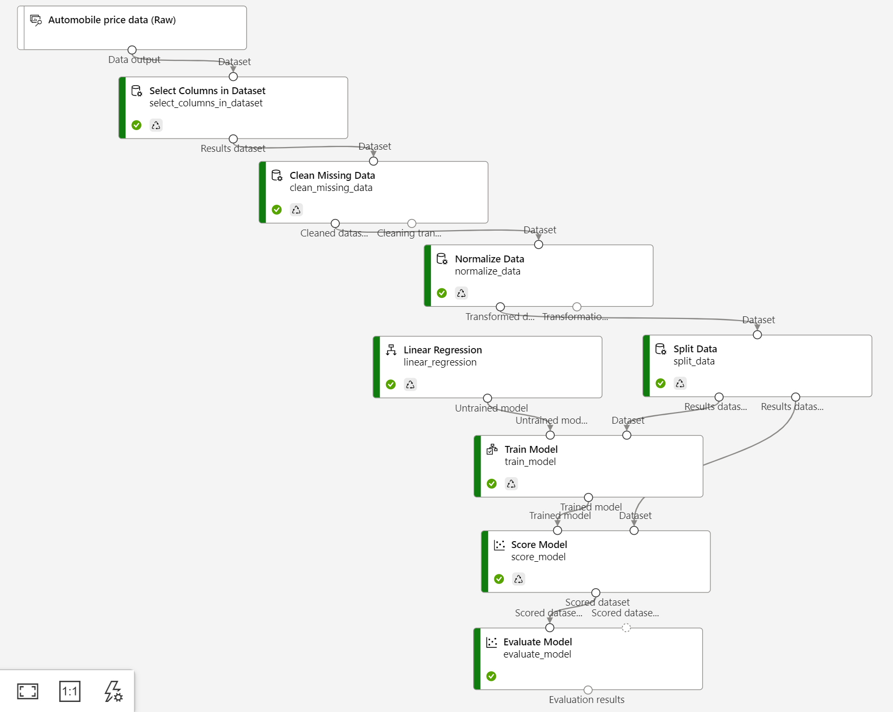

# price-prediction-azure-ml-studio
Azure ML pipeline for prediction of automobile price

Azure ML Designer provides a drag-and-drop interface for building and visualizing pipelines, making it easier to create and modify machine learning workflows without writing any code. The accuracy of your price prediction model will depend on the quality and quantity of your data, the relevance of your features, and the appropriateness of your chosen algorithm. It is important to experiment with different models and parameters and perform cross-validation to ensure the robustness of your predictions.

# Price Prediction of Vehicles using Azure ML Designer

To create a price prediction model for vehicles using Azure ML Designer, follow these steps:

1. Create a new Azure ML Designer pipeline: Navigate to the Azure Machine Learning workspace and create a new pipeline in the Azure ML Designer.

2. Import your dataset: Import vehicle dataset into the pipeline by adding a dataset module to the pipeline and configuring it to point to the location of your data.

3. Data preparation: Preprocess your data by adding data transformation modules to the pipeline. These can include modules for handling missing values, encoding categorical features, and scaling numeric features.

4. Feature selection: Select the most relevant features for predicting vehicle price by adding a feature selection module to the pipeline. This module can use techniques like correlation analysis, feature importance, or dimensionality reduction.

5. Model selection: Choose a machine learning algorithm to train your model by adding a regression module to the pipeline. Common algorithms for regression problems like vehicle price prediction include linear regression, decision trees, and random forests.

6. Model training: Train your model using the selected algorithm and the prepared dataset by adding a train model module to the pipeline.

7. Model evaluation: Evaluate your model's performance using metrics like mean squared error (MSE), mean absolute error (MAE), and R-squared by adding an evaluate model module to the pipeline.

8. Model deployment: Deploy your model as a web service or a batch execution job so that it can be used for predictions by adding a deploy model module to the pipeline.

9. Prediction: Use your deployed model to predict the price of new vehicles by adding a score model module to the pipeline and configuring it to input the new vehicle features and output the predicted price.
